# 🩺 health.log

**완전 로컬에서 동작하는 AI 기반 통합 건강 트래커**
*검진 PDF · 식단 · 체중 · 운동 · 수면 — 단일 HTML 파일, 외부 의존성 0, 로컬 LLM (Ollama) 연동*

[](https://opensource.org/licenses/MIT)
[](https://developer.mozilla.org/en-US/docs/Web/JavaScript)
[](https://ollama.com)
[]()
[]()

> 약 8,500 LOC · 단일 HTML 파일 · 의존성 0 (PDF.js CDN 만) · 빌드 시스템 없음

---

## 🎯 프로젝트 한눈에 보기

| 항목 | 내용 |
|---|---|
| **개발 기간** | 2026.05.16 ~ 진행 중 |
| **개발 인원** | 1인 (기획·설계·개발·배포 전담) |
| **기술 스택** | Vanilla JavaScript · HTML5 Canvas · PDF.js · Ollama (Local LLM) |
| **배포 형태** | 단일 HTML 포터블 / Node.js 호스팅 (Express + PM2 + Cloudflare Tunnel) |
| **AI 모델** | gemma4:31b-cloud (vision + 한국어) / gemma3:27b / llama3.2-vision / qwen2.5-vl |
| **개인정보 보호** | 모든 데이터·AI 분석 100% 로컬 (외부 전송 0) |

---

## 🆕 v2 업데이트 (2026.06.23) — 오토파지(간헐적단식) 타이머

> **v1 → v2 변경 요약.** 포터블 버전 + 호스팅 버전(krrr.cloud/diet) 동시 반영. 기존 데이터·설정은 그대로 유지됩니다(STORAGE_KEY 보존).

| 구분 | v1 | v2 (신규) |
|---|---|---|
| **오토파지 타이머** | 없음 | ⏱ **신규 탭** — 1초 단위 라이브 단식 시계 |
| **단식 프리셋** | — | 16:8 · 18:6 · 20:4 · OMAD(23h) · 커스텀 |
| **단식 단계 타임라인** | — | 경과 시간별 대사 전환 6단계 시각화 (식후→흡수후→글리코겐 고갈→대사 스위치→오토파지→peak) |
| **공복 무결성 가이드** | — | 칼로리 섭취 시 오토파지 중단 경고 + 허용 음료 안내 |
| **루틴 템플릿** | — | 🏢 직장인 16:8 · 🥩 키토제닉 16:8 원클릭 적용 |
| **레퍼런스 카드** | — | Ohsumi(2016 노벨상) · de Cabo & Mattson(NEJM 2019) 근거 |
| **완료 기록·통계** | — | 단식 횟수 · 평균 시간 · 오토파지 도달 횟수 집계 |
| **다기기 동기화** | weights/days/meals | + **단식 기록(history) union-by-id** + 활성 상태 newer-wins 병합 |

**핵심 근거 (앱 내 레퍼런스 카드 수록):**
- **Yoshinori Ohsumi (2016 노벨 생리·의학상)** — 오토파지 메커니즘 규명. 영양 결핍 시 세포가 손상 단백질·소기관을 분해·재활용.
- **de Cabo & Mattson, NEJM 2019** — 간헐적 단식의 "대사 스위치"는 공복 약 12h 부근에서 글리코겐 고갈 → 지방·케톤 사용으로 전환.
- ※ 인간 오토파지의 정량 측정은 어렵고 시점은 개인차(근육량·활동량·마지막 식사 구성)에 크게 좌우 — 앱의 시간대는 일반적 가이드.

### 🔄 v1 사용자 → v2 데이터 이전 (기존 기록 그대로 유지)

> **결론:** v2는 STORAGE_KEY를 그대로 유지하므로 기존 체중·식단·검진 데이터가 **자동 보존**됩니다. 단, 포터블(file://)에서 HTML 파일을 교체하거나 다른 기기로 옮길 때는 아래 **JSON 백업/복원**으로 안전하게 이전하세요.

**이전 4단계 (헤더의 💾 / 📂 버튼 사용):**

1. **(v1에서) 💾 JSON 저장** 클릭 → `diet-log-YYYY-MM-DD.json` 백업 파일 다운로드 (모든 데이터 1개 파일)
2. **v2로 교체** — 포터블: 새 `index.html`로 교체 / 호스팅(krrr.cloud/diet): `Cmd+Shift+R` 강력 새로고침
3. **(v2에서) 📂 불러오기** 클릭 → 1번 백업 파일 선택 → **"확인(덮어쓰기)"** 선택
4. **완료** — 기존 체중·식단·운동·검진 전부 유지 + ⏱ **오토파지 탭이 자동 추가**됨

> **호스팅 로그인 사용자**는 서버 동기화(field-level union merge)로 자동 유지되어 별도 이전이 불필요합니다.

**자동 검증 (20개 테스트 통과):** v1 백업 JSON(오토파지 필드 없음)을 `mergeDefaults()`로 이전 시 ① v1 데이터 100% 보존(체중·일자·settings·검진·리마인더) ② `fasting` 필드 기본값 자동 추가(16:8) ③ 신규 settings 키 백필 ④ 자기 백업 불러오기 시 오경고 미발생(`health.log`/`diet.log` 양쪽 허용) 모두 확인.

---

## 💡 왜 만들었는가 (Problem → Solution)

### 문제 정의

상용 건강 트래커들의 한계:
1. **개인 의료 정보 외부 서버 전송** — 검진 PDF·체중·식단 모두 클라우드
2. **검진 PDF는 사람이 수동 입력** — 27p 검진지 텍스트 추출 + 분류 직접
3. **AI 분석은 유료 구독** — OpenAI/Claude API 비용 부담
4. **다이어트 트래커는 GLP-1 약물 환경 미고려** — 위장 정체·야간 룰 등 처방 약물 컨텍스트 부재
5. **단편적 도구 (체중/식단/운동/검진 따로)** — 통합 view 없음

### 해결책

**완전 로컬에서 동작하는 통합 트래커** — 검진 PDF → 로컬 LLM → 체중/식단/운동/수면과 자동 통합. 외부 의존성 0, 빌드 X, 단일 HTML 파일로 배포.

---

## ✨ 핵심 기능

### 1. 검진 PDF AI 자동 분석 (핵심 차별점)

- 검진 PDF 업로드 (다중 파일, 비밀번호 보호 PDF 자동 모달 처리)
- **클라이언트 사이드 PDF.js 처리** — PDF → canvas → JPEG dataURL → 로컬 Ollama vision API
- 한국 검진지 구조 (KMI/일반의원 등) 학습된 prompt 로 27p 검진지도 JSON 자동 추출
- 의심 질환 자동 카테고리 분류 (이상지질혈증/고혈압/지방간/요산/심전도/전립선/갑상선 등 12종)
- 결과 preview 사용자 검토 + JSON 직접 편집 가능 → 적용 시 체중 로그·BMR 자동 갱신

### 2. 동적 BMR/TDEE 계산 (의학 공식 3종 비교)

- **Mifflin-St Jeor** (1990, 표준): 체중·키·나이 기반
- **Katch-McArdle** (체성분 정확): LBM 기반 (`370 + 21.6 × LBM`)
- **InBody 직접 측정값** (가장 정확): 검진 자료에서 자동 추출
- 체중 입력마다 3공식 모두 실시간 재계산 + 비교 표시
- 활동 수준 (1.2 ~ 1.9) 변경 시 TDEE 즉시 갱신
- **stale 경고** — InBody 측정 시점 체중과 현재 차이 5kg+ 시 자동 알림

### 3. 근손실 방지 최소 기준 검증 (ISSN 2017 가이드)

- 최소 칼로리: `max(BMR, 1500)` — 절대 한계
- 안전 최저: `BMR + 200` — 지속 가능
- 단백질 최소/권장/상한: 1.6 / 2.0 / 2.4 g/kg 체중
- **활동 수준 낮으면 자동 안전 캡** — TDEE−1000 < BMR 한계 시 권장값 자동 캡 + 경고
- 현재 설정 (목표 칼로리 / 단백질) 안전 범위 검증 + 실시간 ⚠ 알림

### 4. 식단 AI 스캔 (음식 사진 → 영양 정보 자동 추출)

- 음식 사진 / 영양성분표 / 혼합 이미지 다중 업로드
- 로컬 Ollama vision 으로 한국 음식 분석
- **confidence 뱃지** (high/medium/low) + 항목별 inline 편집
- 끼니 추가 / 즐겨찾기 등록 (이미지 + 영양 정보 보관)

### 5. GLP-1 약물 환경 동적 분기 (도메인 지식)

- 설정에서 GLP-1 약물 선택 (마운자로 / 위고비 / 기타) 시:
  - 야간 고형물 경고 활성 (22:30 이후)
  - 위장 정체 부작용 모니터링 (GI 불편도 + 배변)
  - 단백질 권장량 자동 상향 (1.6 → 2.0 g/kg)
  - 타이밍 풀로우 탭 표시
- 미사용자는 관련 UI 자동 숨김

### 6. 다기기 동기화 (호스팅 버전 한정)

- Express 백엔드 + JSON 파일 저장
- **field-level union merge** — `lastUpdatedAt` 단순 비교 대신 weights/days/exercises/meals.items 모두 union
- `_goalsUpdatedAt` timestamp marker — server admin 강제 업데이트 vs client stale 충돌 해결
- `visibilitychange` + `focus` 이벤트 자동 재pull
- `Cache-Control: no-store` + `?t=Date.now()` cache buster — Safari GET 캐싱 우회
- `navigator.sendBeacon()` — 페이지 떠날 때 in-flight write 보호

### 7. 분석 페이지 (외부 라이브러리 없이 시각화)

- 14일 단백질/칼로리/걸음 trend bar
- 4주 운동 볼륨 (RPE × 분 합산)
- SVG / D3 / Chart.js 없이 flexbox + `height: pct%` 로 구현 (단일 HTML 유지)

### 8. 오토파지(간헐적단식) 타이머 ⏱ (v2 신규)

- **1초 단위 라이브 단식 시계** — `requestAnimationFrame` 없이 `setInterval(1s)` + `tabular-nums` 골드 디스플레이
- **프리셋 5종** — 16:8 / 18:6 / 20:4 / OMAD(23h) / 커스텀 시간
- **대사 단계 타임라인 6구간** — 식후(mTOR 활성) → 흡수 후기 → 글리코겐 고갈 → 대사 스위치(~12h, AMPK 활성·케톤 생성) → 오토파지 본격화(~16h) → peak(~24h, GH↑). 현재 경과 시간 구간 자동 하이라이트
- **공복 무결성 경고** — 공복 중 칼로리 섭취 시 인슐린·mTOR 자극으로 오토파지 즉시 중단 안내 (허용: 물·블랙커피·무가당 차·전해질)
- **루틴 템플릿** — 직장인 16:8 / 키토제닉 16:8 원클릭 적용
- **완료 기록 + 통계** — 단식 횟수·평균 시간·오토파지 도달 횟수. 다기기 sync 시 `history` union-by-id 병합 (기록 유실 0)
- 근거: Ohsumi(2016 노벨상) · de Cabo & Mattson(NEJM 2019) — 앱 내 레퍼런스 카드 명시

---

## 🛠 기술적 도전

### 1. 단일 HTML 파일 패러다임 — 빌드 시스템 0

- 의존성 0 (PDF.js CDN 외) — 다운로드 즉시 사용 가능
- 사용자 컴퓨터에 Node/npm/yarn 설치 불필요
- 약 320KB 단일 파일에 SPA + 데이터 모델 + AI 통합 모두 포함

### 2. Privacy-first 아키텍처

- 모든 데이터 처리 100% 로컬
- AI 호출도 `localhost:11434` 만
- 검진 PDF 처리도 클라이언트 canvas + 로컬 Ollama
- 외부 서버 전송 0 — HIPAA/개인정보 위험 X

### 3. 로컬 LLM 통합 가이드 (CORS 우회)

- `file://` 에서 `localhost` Ollama 호출 시 CORS 문제 발생
- OS별 (macOS launchctl / Windows 환경변수 / Linux systemctl) 영구 설정 가이드 + 트러블슈팅 9종

### 4. 의학 도메인 정확성

- BMR 3공식 비교 (Mifflin / Katch / InBody) — 일반 트래커는 1공식만
- ISSN 2017 Sports Nutrition Guidelines 정확 적용
- 대한비만학회 2022 BMI 분류 (아시아인 기준)
- GLP-1 약물 환경 별도 분기 (처방 의학 지식)

### 5. null-safe 데이터 처리 (사람마다 다른 검진 결과)

- 검진지마다 항목 다름 (간기능만 있거나, 갑상선만 있거나, 모든 항목 풀세트거나)
- AI 추출 결과의 `cvdRisk` / `targets` / `metrics[].note` 등 모두 optional
- 동적 카드 표시 (데이터 있을 때만 카드 렌더링, 없으면 자동 hide)
- `summary.suspect[]` 키워드 매칭으로 자동 카테고리 분류 (12종 + fallback)

### 6. PDF.js 클라이언트 처리

- 비밀번호 보호 PDF 자동 감지 → 전용 모달 → 비밀번호 입력 (3회 제한)
- 페이지별 canvas 렌더링 → JPEG 0.85 dataURL → multi-image vision API
- 27p 검진지도 모든 페이지 처리

### 7. UX 깊은 고민 (실제 사용자 시나리오 검증)

- 다기기 sync silent fail 3-layer 안전망 (압축 + await + sendBeacon)
- localStorage 5-10MB quota 회피 (이미지 canvas downscale + JPEG 0.85)
- iOS Safari nested clickable 함정 (button > span onclick → sibling 분리)
- 안전 가드의 anti-user 함정 회피 (자동 복구가 사용자 데이터 wipeout X)

---

## 📸 스크린샷

### 체중 로그 — BMR 3공식 + 근손실 방지
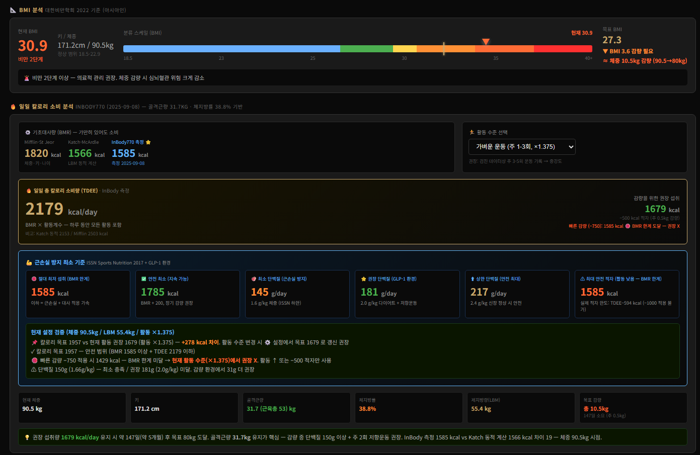
*BMI 분석 + 일일 칼로리 소비 분석 (Mifflin / Katch / InBody 3공식 동시 비교) + TDEE + 권장 섭취 + 💪 근손실 방지 최소 기준 6카드 (BMR 한계·안전 최저·최소·권장·상한 단백질·최대 적자) + 현재 설정 자동 검증*

### 캘린더 — 월간 평가 + 요약
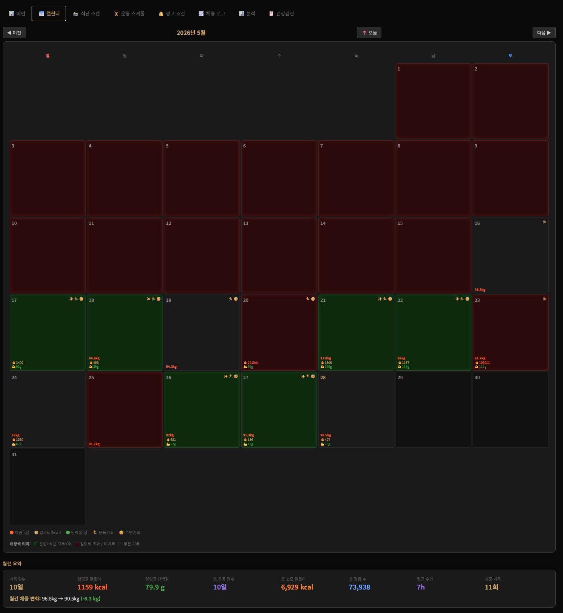
*월별 캘린더 — 일별 평가 색상 (운동✓+식단≤목표 = 초록 / 칼로리 초과 = 빨강 / 부분 기록 = 회색) + 월간 요약 (기록 일수·평균 칼로리·평균 단백질·체중 변화)*

### 일자 상세 모달 — 통합 view
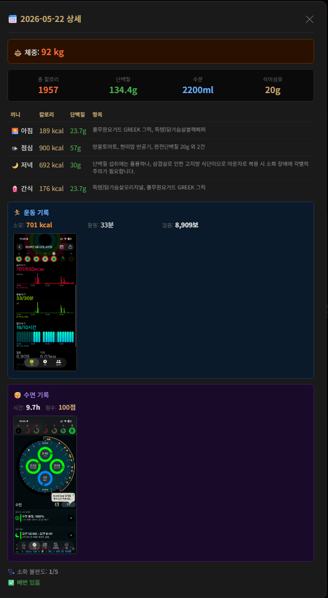
*캘린더 셀 클릭 시 팝업 — 체중 + 끼니별 단백질·칼로리 + 애플 피트니스 운동 + AutoSleep 수면 + 소화 불편도/배변 통합 view*

### AI 분석 입력 예시 — AutoSleep / 애플 피트니스 스크린샷
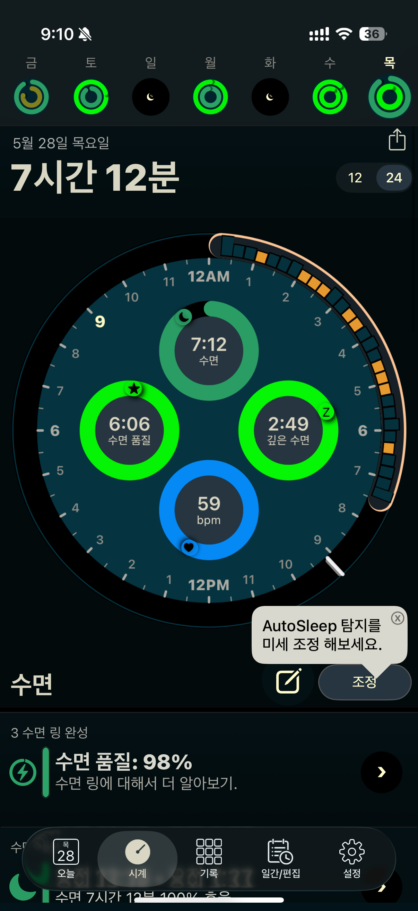
*AutoSleep (애플워치 연동) 스크린샷 — AI 자동 분석으로 수면 시간·품질·심박수 자동 추출*

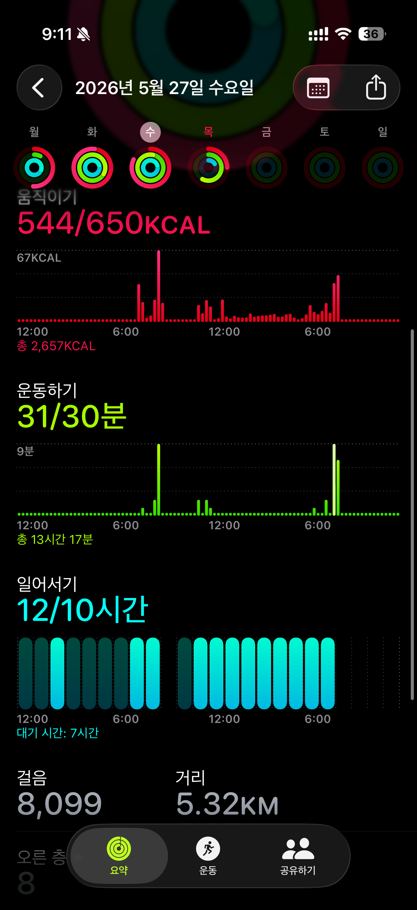
*애플 피트니스 활동 링 스크린샷 — 움직이기/운동하기/일어서기/걸음 자동 추출*

### 건강검진 AI 분석 (핵심)
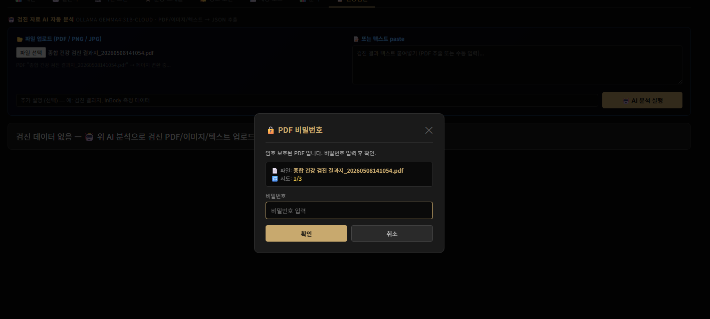
*검진 자료 AI 자동 분석 — 암호 보호 PDF 감지 시 전용 모달 자동 표시 (파일명 + 시도 카운터 + 3회 제한)*

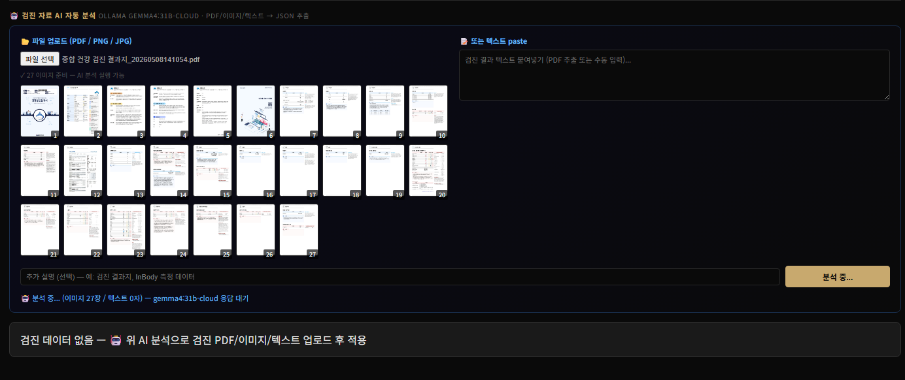
*PDF.js 로 다중 페이지 → JPEG 자동 변환 + thumbnail preview + gemma4:31b-cloud vision API 응답 대기*

### GLP-1 약물 환경 분기 (도메인 지식)
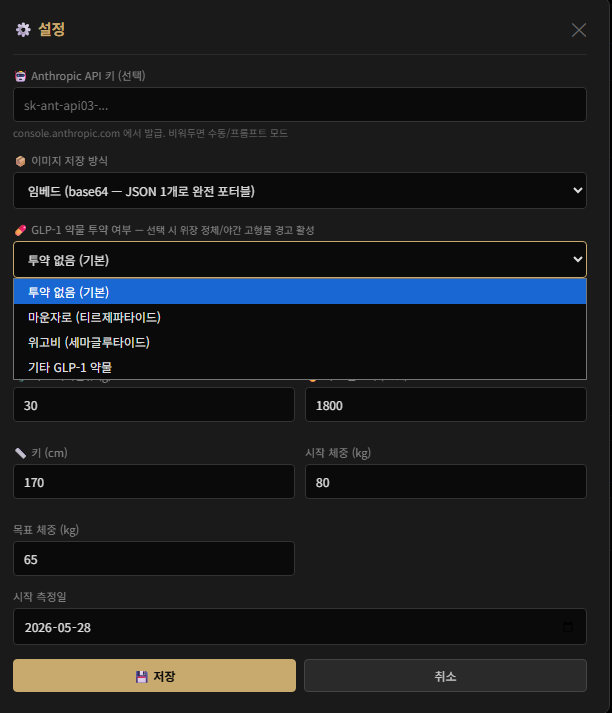
*⚙️ 설정 모달 — GLP-1 약물 (마운자로 티르제파타이드 / 위고비 세마글루타이드 / 기타) 선택 시 위장 정체 경고 + 야간 고형물 룰 + 단백질 권장량 자동 조정. 미사용자는 관련 UI 자동 숨김*

### 식단 스캔 — 사진 → 영양 자동 추출
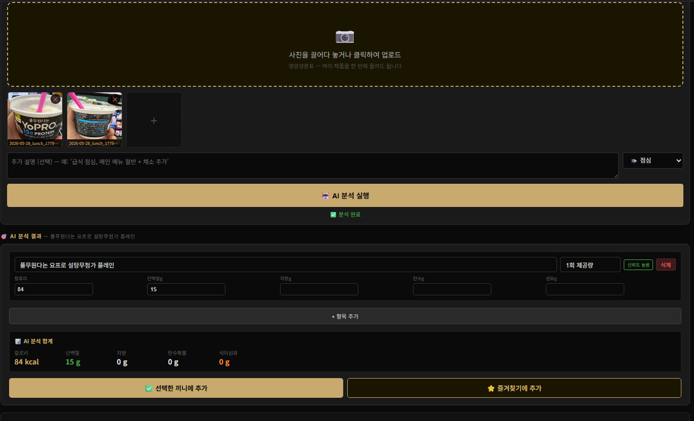
*음식 사진 / 영양성분표 / 혼합 이미지 다중 업로드 → AI confidence 뱃지 + 항목별 inline 편집 → 선택한 끼니에 추가 또는 즐겨찾기 등록*

### 분석 페이지 — trend
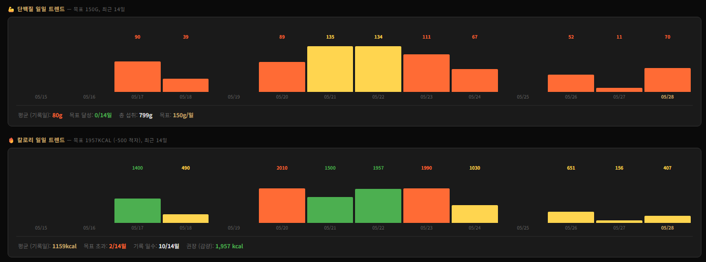
*📈 분석 탭 — 단백질 일일 트렌드 + 칼로리 일일 트렌드 (목표 대비 색상 분류, 최근 14일)*

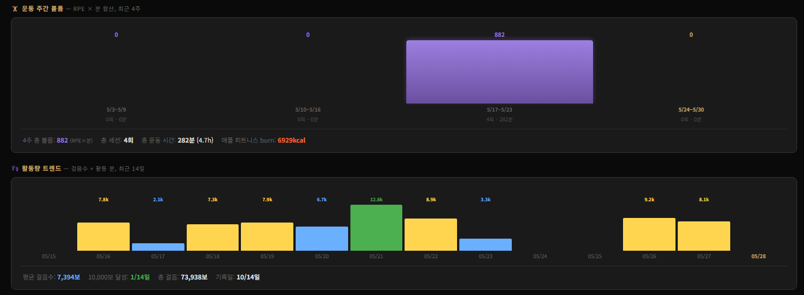
*운동 주간 볼륨 (RPE × 분 합산, 최근 4주) + 활동량 트렌드 (걸음수 14일)*

### 헤더 + 사용법
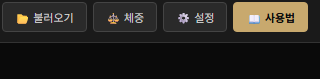
*헤더 우측 — 📂 불러오기 / ⚖️ 체중 / ⚙️ 설정 / 📖 사용법 (포터블 모드는 우측상단 사용법 클릭으로 A to Z 가이드 접근)*

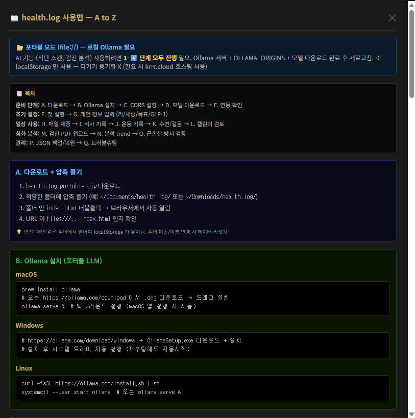
*health.log 사용법 모달 — 포터블 모드 안내 + 목차 (A 다운로드 → Q 트러블슈팅) + B. Ollama 설치 (macOS/Windows/Linux)*

### 모바일에서 로컬 Ollama 연동 (보너스 가이드)
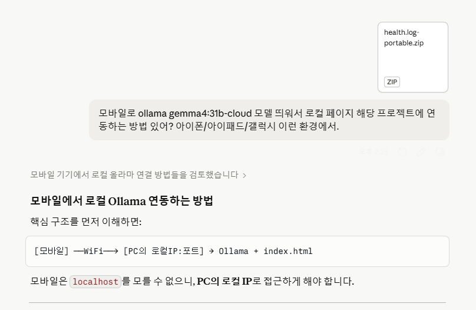
*모바일(아이폰/아이패드/갤럭시)에서 PC의 로컬 Ollama 에 연동하는 방법 — `[모바일] →WiFi→ [PC의 로컬IP:포트] → Ollama + index.html`*

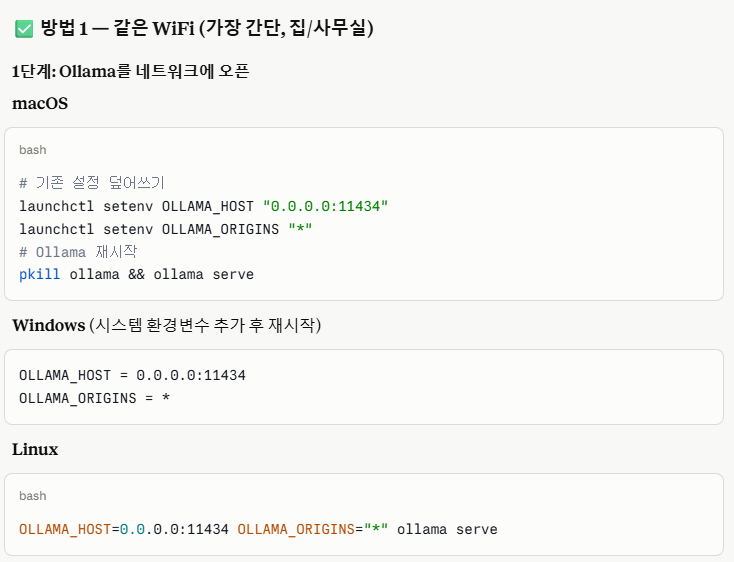
*방법 1: 같은 WiFi (가장 간단) — Ollama 를 `0.0.0.0:11434` 로 바인딩 + OLLAMA_ORIGINS `*` 설정 (macOS launchctl / Windows 환경변수 / Linux export)*

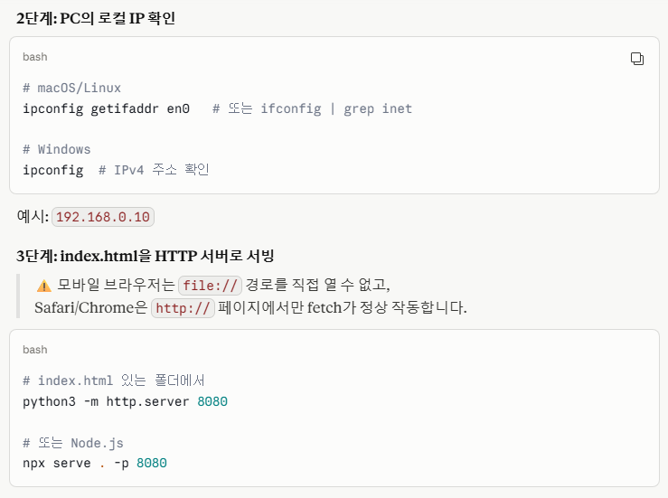
*방법 1 (이어서) — `ipconfig getifaddr en0` 으로 PC 로컬 IP 확인 후 `python3 -m http.server 8080` 또는 `npx serve` 로 index.html HTTP 서빙 (모바일은 file:// 직접 열 수 없음)*

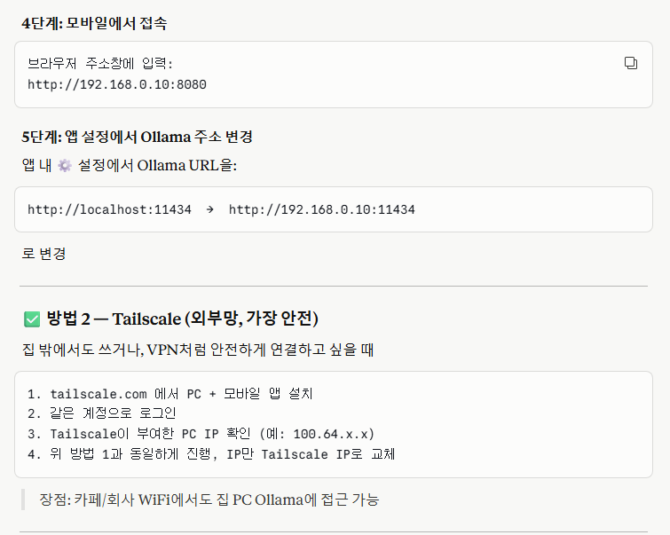
*4단계 모바일 접속 (`http://192.168.x.x:8080`) + 5단계 앱 설정에서 Ollama URL 변경. 방법 2 — Tailscale (VPN 처럼 안전, 외부망에서도 가능)*

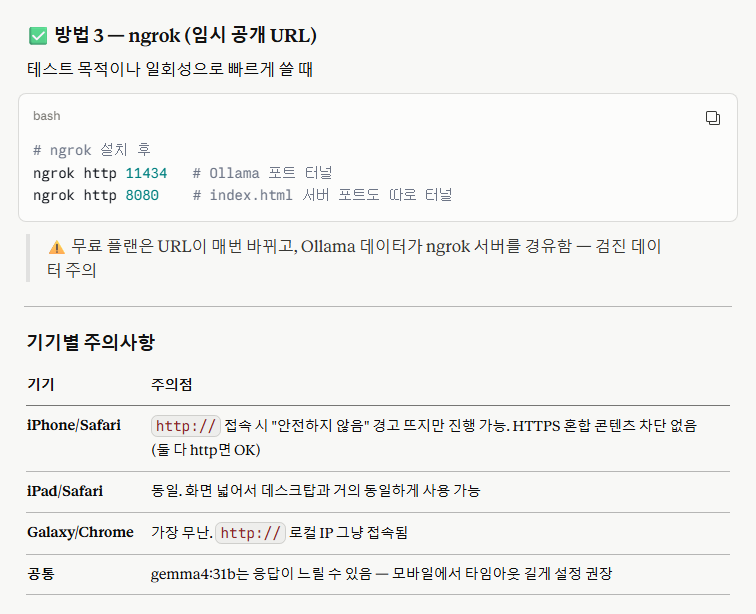
*방법 3 — ngrok 임시 공개 URL (테스트 용도) + 기기별 주의사항 (iPhone/iPad Safari "안전하지 않음" 경고 / Galaxy Chrome 무난 / 공통: gemma4:31b 응답 지연 시 타임아웃 길게)*

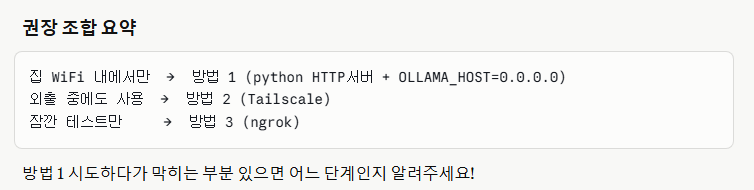
*권장 조합 — 집 WiFi 내에서만 → 방법 1 (python HTTP + OLLAMA_HOST) / 외출 중에도 → 방법 2 (Tailscale) / 잠깐 테스트 → 방법 3 (ngrok)*

---

## 🚀 빠른 시작

### 사용자 (포터블)

1. [Releases](../../releases) 에서 `health.log-portable.zip` 다운로드
2. 적당한 폴더에 압축 풀기
3. `index.html` 더블클릭 → 브라우저에서 열림
4. 헤더의 **📖 사용법** 버튼 → A to Z 단계별 안내

### 개발자 (clone)

```bash
git clone https://github.com/<USER>/health.log.git
cd health.log
open index.html  # macOS
# Linux: xdg-open index.html
# Windows: start index.html
```

### AI 기능 활성화 (선택)

```bash
# 1. Ollama 설치 (macOS)
brew install ollama

# 2. CORS 설정 (file:// 필수)
launchctl setenv OLLAMA_ORIGINS "*"
osascript -e 'tell app "Ollama" to quit' && open -a Ollama

# 3. 모델 다운로드 (vision 지원 필수)
ollama pull gemma4:31b-cloud  # 권장 (한국어 강함)

# 4. 연동 확인
curl http://localhost:11434/api/tags
```

자세한 OS별 가이드는 헤더 **📖 사용법** 버튼 또는 [Wiki](../../wiki) 참조.

---

## 📐 계산 / 가이드라인 출처

| 항목 | 출처 |
|---|---|
| BMR — Mifflin-St Jeor | Mifflin MD, et al. 1990. *Am J Clin Nutr* |
| BMR — Katch-McArdle | Katch FI, McArdle WD. 1981. *Nutrition, Weight Control, and Exercise* |
| TDEE 활동계수 | Harris JA, Benedict FG. 1919 |
| 단백질 권장 (1.6-2.4 g/kg) | ISSN Position Stand 2017. *J Int Soc Sports Nutr* |
| BMI 분류 (아시아인) | 대한비만학회 2022 진료지침 |
| GLP-1 약물 가이드 | Eli Lilly/Novo Nordisk 처방 정보 + 의학 문헌 |

---

## 🛡 보안 / 면책

- ✅ **완전 로컬 처리** — 데이터·AI 모두 사용자 PC 안에서만
- ✅ **외부 전송 0** — 백엔드 호스팅 모드에서도 본인 서버만
- ✅ **암호화 권장** — JSON 백업 파일은 사용자가 직접 관리
- ⚠ **의료 진단 대체 X** — 모니터링 보조 도구. 의심 소견 시 의료진 상담 필수
- ⚠ **자기 책임 사용** — 본인 건강 관리 용도. 타인 처방/진단 X

---

## 🗺 로드맵

- [ ] 영문 i18n (현재 한국어만)
- [ ] 모바일 PWA 변환 (현재 file:// + 브라우저)
- [x] **추가 AI 모델 자동 감지 (Claude/OpenAI/Gemini API)** — Web Crypto AES-GCM 양방향 암호화 + `/models` endpoint 자동 감지 + vision 지원 모델 필터링
- [ ] 운동 사진 분석 (자세 / 폼 체크)
- [ ] InBody 시계열 trend 그래프
- [x] **의료진 공유용 PDF export** — `window.print()` + `@media print` (의존성 0, 한글 완벽, vector text)
- [x] **오토파지(간헐적단식) 타이머** — 1초 라이브 시계 + 대사 단계 6구간 타임라인 + 프리셋 5종 + 다기기 sync (v2)

---

## 📦 기술 스택 상세

| 영역 | 사용 기술 / 라이브러리 | 비고 |
|---|---|---|
| Frontend | Vanilla JavaScript (ES2020+) | 프레임워크 0 |
| 마크업 | HTML5 + 단일 파일 | 빌드 0 |
| 스타일 | Inline CSS + CSS variables | 외부 CSS 0 |
| PDF 처리 | PDF.js 3.11 (CDN) | 클라이언트 처리 |
| AI | Ollama (local LLM) | vision 지원 모델 |
| 저장소 | localStorage + JSON file | 사용자 export |
| 백엔드 (호스팅) | Node.js + Express + PM2 | 다기기 sync 시 |
| 터널 | Cloudflare Tunnel | 외부 접속 시 |
| 인증 | JWT cookie (선택) | 호스팅 모드 |

---

## 🤝 기여 / 피드백

- Issue/PR 환영합니다
- 버그 제보 시 환경 정보 (OS / 브라우저 / Ollama 모델 / 검진지 종류) 포함 부탁드립니다

---

## 📄 라이선스

MIT License — 자세한 내용은 [LICENSE](./LICENSE) 참조.

---

## 👤 개발자

> 본 프로젝트는 1인 풀스택 개발 (기획·설계·구현·UI/UX·테스트·배포·문서화 전담) 결과물입니다.
> 의학 도메인 지식 + 로컬 LLM 통합 + 클라이언트 처리 패러다임을 종합 적용한 사례입니다.

문의 / 협업: GitHub Issue 또는 프로필 연락처

---

> 본 도구는 개인 건강 모니터링 용도입니다. **의료 진단 대체 X** — 의심 소견 발견 시 반드시 의료진 상담 필수.
